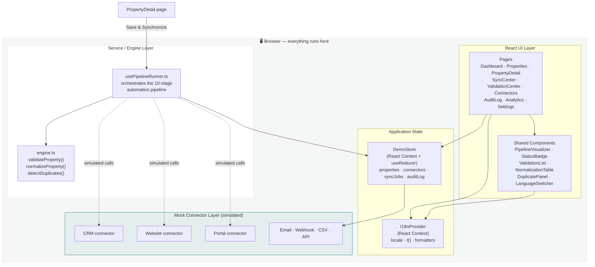
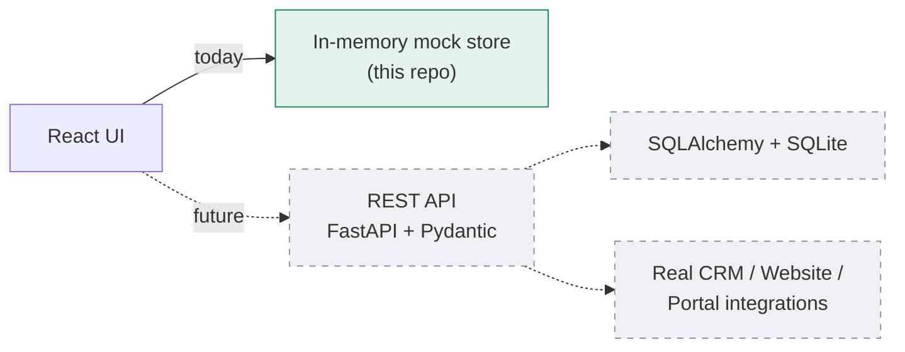
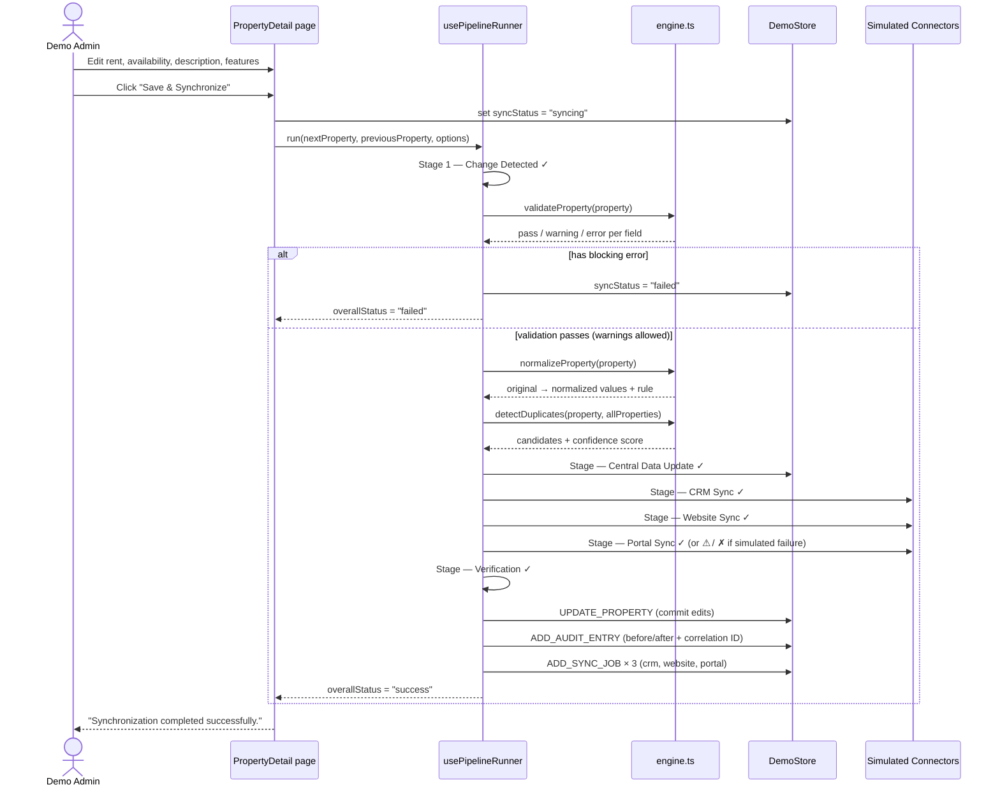
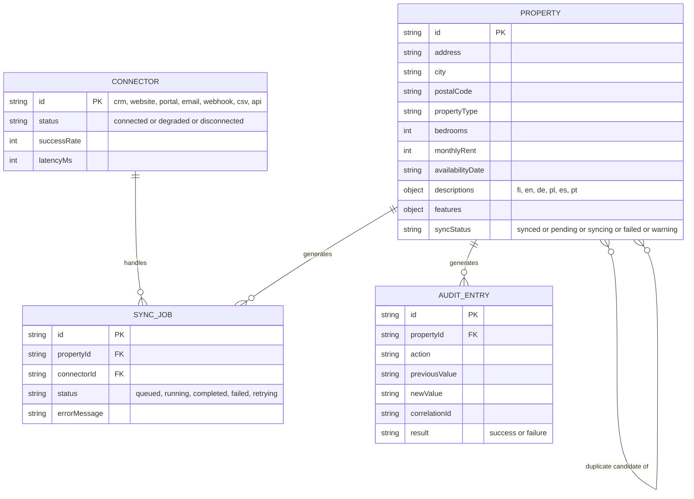
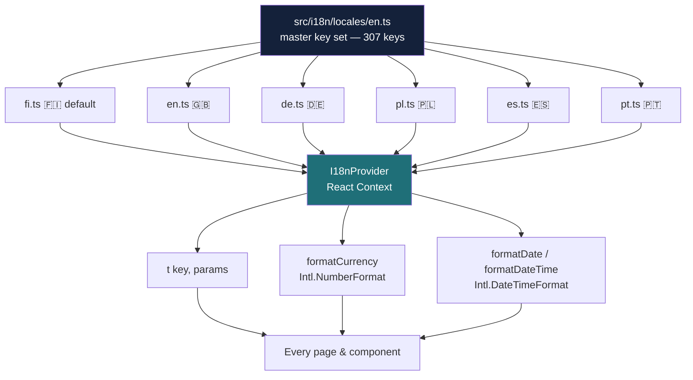
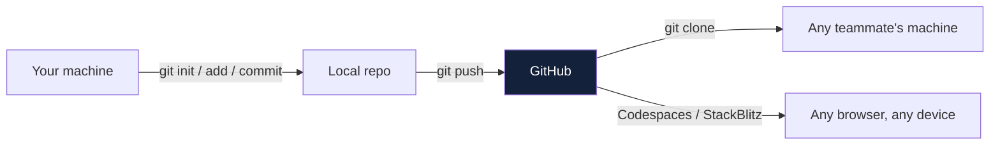

<div align="center">


# SYJ PropertySync

### Property Listing Synchronization & Automation

**An interactive proof-of-concept prepared for Turun Seudun Vuokravälitys Oy (TSVV) · Turku, Finland**

*A SAYANJALI NEXUS demonstration*


[](#-demo-disclaimer)
[](#-tech-stack)
[](#-multilingual-architecture)
[](#-tech-stack)
[](#-license--disclaimer)

</div>

<br/>

## ⚠️ Demo disclaimer

> [!WARNING]
> This is a **free custom demonstration / proof of concept**, not a production integration with TSVV's systems. It is **not connected** to TSVV's real CRM, website, property portals, or internal databases. Every connector is a **Demo / Simulated Integration**, and every property record is fictional demo data. No claim of TSVV approval is made or implied.

---

## ⚡ 60-second quickstart

```bash
git clone https://github.com/<your-username>/<your-repo>.git
cd syj-propertysync
npm install
npm run dev
```

Then open **http://localhost:5173** — Finnish loads by default, no configuration needed. Full step-by-step instructions for every OS are in [Installation — every device](#-installation--every-device).

---

## 📖 Table of contents

- [Demo disclaimer](#-demo-disclaimer)
- [60-second quickstart](#-60-second-quickstart)
- [What this demonstrates](#-what-this-demonstrates)
- [Live walkthrough (animated)](#-live-walkthrough-animated)
- [System architecture](#-system-architecture)
- [The automation pipeline](#-the-automation-pipeline)
- [Data model](#-data-model)
- [Multilingual architecture](#-multilingual-architecture)
- [Tech stack](#-tech-stack)
- [Project structure](#-project-structure)
- [Installation — every device](#-installation--every-device)
  - [Prerequisites checklist](#-prerequisites-checklist)
  - [Windows](#-windows)
  - [macOS](#-macos)
  - [Linux](#-linux)
  - [Mobile / tablet / Chromebook](#-mobile--tablet--chromebook-no-install)
- [Running the project](#-running-the-project)
- [Building for production](#-building-for-production)
- [Pushing to GitHub](#-pushing-to-github)
- [Suggested demo recording script](#-suggested-demo-recording-script)
- [Troubleshooting](#-troubleshooting)
- [Potential operational benefits](#-potential-operational-benefits)
- [Developer](#-developer)
- [License & disclaimer](#-license--disclaimer)

---

## 🎯 What this demonstrates

The core business proposition, made tangible:

> **Update a property once → automatically validate, normalize, and synchronize the information across every connected destination.**

| Capability | Where to see it |
|---|---|
| 🏠 Live property portfolio around Turku, Kaarina, Raisio, Lieto, Paimio | `Properties` |
| ✏️ Edit a listing and trigger a full sync in one click | `Properties → any listing → Edit & Sync Property` |
| ⚙️ Animated, staged automation pipeline with live timing | Triggered from `Save & Synchronize` |
| ✅ Real validation engine (required fields, formats, missing data) | `Validation Center` |
| 🔤 Real normalization engine (city names, currency, units, phone/postal formats) | Pipeline run → *Normalization* section |
| 🧩 Duplicate detection with a confidence score | Pipeline run → *Duplicate detection* section |
| 🔌 Simulated connectors (CRM, Website, Portal, Email, Webhook, CSV, API) | `Connectors` |
| 🛠️ Controlled failure + one-click retry (error recovery) | `Sync Center → DEMO-PAIMIO-5019 → Retry` |
| 📜 Full before/after audit trail with correlation IDs | `Audit Log` |
| 📊 Portfolio-wide analytics | `Analytics` |
| 🌍 Six fully-translated languages, Finnish by default | Language switcher, top-right |
| ♻️ One-click reset back to seeded demo state | `Settings → Reset demo`, or the top strip |

> [!NOTE]
> Everything runs **entirely in the browser** against an in-memory mock data layer — nothing to deploy, no database, no API keys, no backend to configure.

---

## 🎬 Live walkthrough (animated)

<div align="center">

</div>

> [!TIP]
> Record your own demo video by following the same steps — see the [full script](#-suggested-demo-recording-script) below. Just screen-record `npm run dev` in your browser; no cloud deployment needed.

### Pipeline state animation

Each stage below animates through **Pending → Running → Completed** (or **Warning** / **Failed**) in the live app, with a progress line that fills as stages complete:

```mermaid
flowchart LR
    A([📝 Change<br/>Detected]) --> B([✅ Data<br/>Validation])
    B --> C([🔤 Data<br/>Normalization])
    C --> D([🧩 Duplicate<br/>Detection])
    D --> E([🗄️ Central Data<br/>Update])
    E --> F([🔗 CRM<br/>Sync])
    F --> G([🌐 Website<br/>Sync])
    G --> H([🏢 Portal<br/>Sync])
    H --> I([🔍 Verification])
    I --> J([📜 Audit<br/>Log])

    style A fill:#E4EEEE,stroke:#1F6F78,color:#14213A
    style B fill:#E4EEEE,stroke:#1F6F78,color:#14213A
    style C fill:#E4EEEE,stroke:#1F6F78,color:#14213A
    style D fill:#FBF0DD,stroke:#B9770E,color:#14213A
    style E fill:#E4EEEE,stroke:#1F6F78,color:#14213A
    style F fill:#E4F4EC,stroke:#1E8E5A,color:#14213A
    style G fill:#E4F4EC,stroke:#1E8E5A,color:#14213A
    style H fill:#FBEAEA,stroke:#C33C3C,color:#14213A
    style I fill:#E4F4EC,stroke:#1E8E5A,color:#14213A
    style J fill:#E4F4EC,stroke:#1E8E5A,color:#14213A
```



*(Colors mirror the live app: teal = neutral/running, green = completed, amber = warning, red = failed — exactly like the `Portal Sync ⚠` example from the original brief.)*

---

## 🏗 System architecture



> [!TIP]
> **Why this shape?** Validation, normalization, duplicate detection, and the connector layer are kept in separate, isolated modules (`src/services/engine.ts`, `src/services/usePipelineRunner.ts`) specifically so a **real backend** (FastAPI + SQLite, per the original architecture brief) could later replace the mock layer **without rewriting the UI**.



---

## ⚙️ The automation pipeline

### End-to-end sequence

*What actually happens when you click "Save & Synchronize":*



### Stage reference table

| # | Stage | Simulated duration | Can warn? | Can fail? |
|---|---|:---:|:---:|:---:|
| 1 | Change Detected | ~0.2s | – | – |
| 2 | Data Validation | ~0.4s | ✅ | ✅ |
| 3 | Data Normalization | ~0.3s | – | – |
| 4 | Duplicate Detection | ~0.3s | ✅ (confidence ≥ 85%) | – |
| 5 | Central Data Update | ~0.5s | – | – |
| 6 | CRM Sync | ~0.8s | – | – |
| 7 | Website Sync | ~0.6s | – | – |
| 8 | Portal Sync | ~0.9s | – | ✅ *(toggle "simulate failure" to demo)* |
| 9 | Verification | ~0.4s | – | – |
| 10 | Audit Log | ~0.2s | – | – |

---

## 🗃 Data model



---

## 🌍 Multilingual architecture

Finnish is the default language for the TSVV demo. Every user-facing string — navigation, forms, validation messages, pipeline statuses, connector statuses, audit entries, analytics, settings — comes from a translation dictionary.

> [!IMPORTANT]
> There are **no hardcoded UI strings** anywhere in the application — this was verified line-by-line against the full translation key set before release.



Each property record also carries **per-language descriptions** (`descriptions.fi`, `descriptions.en`, …), previewable side-by-side in the *Multilingual listing preview* panel on any property's detail page — demonstrating the commercial value of centralized, multilingual listing data.

Language selection persists across sessions and instantly re-renders the entire UI, including number, date, and currency formatting per locale.

| Language | Code | Status |
|---|:---:|:---:|
| Suomi (Finnish) | `fi` | 🟢 Default |
| English | `en` | 🟢 Complete |
| Deutsch | `de` | 🟢 Complete |
| Polski | `pl` | 🟢 Complete |
| Español | `es` | 🟢 Complete |
| Português | `pt` | 🟢 Complete |

---

## 🧰 Tech stack

| Layer | Technology | Why |
|---|---|---|
| UI framework | React 18 + TypeScript | Type-safe, component-driven, industry standard |
| Build tool | Vite 5 | Instant HMR, zero-config, fast cold starts |
| Styling | Tailwind CSS | Custom Nordic design tokens — see `tailwind.config.js` |
| Routing | react-router-dom (`HashRouter`) | Works from any static host, no server routing config |
| Charts | Recharts | Composable, React-native charting |
| Icons | lucide-react | Consistent, tree-shakeable icon set |
| State | React Context + `useReducer` | No external state library needed at this scale |
| Backend | **None required** | In-memory mock service layer models the REST API surface from the original brief |

---

## 📁 Project structure

```text
syj-propertysync/
├── index.html
├── package.json
├── vite.config.ts
├── tailwind.config.js
├── tsconfig.json
└── src/
    ├── main.tsx                  # entry point
    ├── App.tsx                   # router + providers
    ├── types.ts                  # shared TypeScript types
    ├── index.css                 # Tailwind + design system
    │
    ├── data/                     # seed demo data
    │   ├── properties.ts         #   7 fictional Turku-region listings
    │   ├── connectors.ts         #   7 simulated connectors
    │   └── auditSeed.ts          #   seed audit trail
    │
    ├── i18n/
    │   ├── index.tsx             # I18nProvider, useI18n(), formatters
    │   └── locales/              # en · fi · de · pl · es · pt (307 keys each)
    │
    ├── services/
    │   ├── engine.ts             # validation / normalization / duplicate detection
    │   ├── usePipelineRunner.ts  # orchestrates the 10-stage pipeline
    │   └── demoStore.tsx         # global state (Context + useReducer)
    │
    ├── components/
    │   ├── layout/                Nav.tsx · TopBar.tsx
    │   ├── PipelineVisualizer.tsx # the signature animated stepper
    │   ├── ValidationList.tsx · NormalizationTable.tsx · DuplicatePanel.tsx
    │   ├── StatusBadge.tsx · KpiCard.tsx · LanguageSwitcher.tsx
    │   └── DemoTopStrip.tsx · Footer.tsx · Layout.tsx
    │
    └── pages/
        ├── Welcome.tsx            # guided 9-step demo intro
        ├── Dashboard.tsx · Properties.tsx · PropertyDetail.tsx
        ├── SyncCenter.tsx · ValidationCenter.tsx · Connectors.tsx
        └── AuditLog.tsx · Analytics.tsx · Settings.tsx
```

---

## 💻 Installation — every device

### ✅ Prerequisites checklist

| Requirement | Minimum version | Check with |
|---|---|---|
| Node.js | 18.x or newer (20.x recommended) | `node -v` |
| npm | 9.x or newer (bundled with Node) | `npm -v` |
| Git *(optional, for GitHub)* | any recent version | `git --version` |
| A modern browser | Chrome, Edge, Firefox, or Safari | — |

> [!NOTE]
> No database, no Python, no Docker, no paid accounts, no API keys — ever.

<br/>

### 🪟 Windows

<details>
<summary><b>Option A — official installer (recommended for most people)</b></summary>
<br/>

1. Download Node.js LTS from **[nodejs.org](https://nodejs.org)** and run the installer (accept all defaults).
2. Open **PowerShell** and confirm:
   ```powershell
   node -v
   npm -v
   ```
3. Unzip the project (right-click the `.zip` → *Extract All…*), then:
   ```powershell
   cd path\to\syj-propertysync
   npm install
   npm run dev
   ```
4. Open the URL shown in the terminal — typically **http://localhost:5173**.

</details>

<details>
<summary><b>Option B — winget</b></summary>
<br/>

```powershell
winget install OpenJS.NodeJS.LTS
```
Then follow steps 2–4 from Option A above.

</details>

<details>
<summary><b>Option C — WSL (Windows Subsystem for Linux)</b></summary>
<br/>

```bash
wsl --install                      # one-time, then restart
# inside your WSL Ubuntu shell:
curl -fsSL https://deb.nodesource.com/setup_20.x | sudo -E bash -
sudo apt-get install -y nodejs
cd /mnt/c/path/to/syj-propertysync
npm install && npm run dev
```

</details>

<br/>

### 🍎 macOS

<details open>
<summary><b>Option A — Homebrew (recommended)</b></summary>
<br/>

```bash
# if you don't have Homebrew yet:
/bin/bash -c "$(curl -fsSL https://raw.githubusercontent.com/Homebrew/install/HEAD/install.sh)"

brew install node
cd ~/path/to/syj-propertysync
npm install
npm run dev
```

</details>

<details>
<summary><b>Option B — official installer</b></summary>
<br/>

1. Download the macOS installer from **[nodejs.org](https://nodejs.org)** and run it.
2. Open **Terminal** (⌘ + Space → "Terminal") and run:
   ```bash
   cd ~/Downloads/syj-propertysync
   npm install
   npm run dev
   ```
3. Open **http://localhost:5173** in Safari or Chrome.

</details>

<br/>

### 🐧 Linux

<details open>
<summary><b>Debian / Ubuntu</b></summary>
<br/>

```bash
curl -fsSL https://deb.nodesource.com/setup_20.x | sudo -E bash -
sudo apt-get install -y nodejs
```

</details>

<details>
<summary><b>Fedora</b></summary>
<br/>

```bash
sudo dnf install nodejs
```

</details>

<details>
<summary><b>Arch</b></summary>
<br/>

```bash
sudo pacman -S nodejs npm
```

</details>

Then, on any distro:

```bash
cd ~/syj-propertysync
npm install
npm run dev
```

Open **http://localhost:5173**.

<br/>

### 📱 Mobile / tablet / Chromebook (no install)

You can't run a Vite dev server natively on iOS or Android, but you can run this project **entirely in the cloud** from a phone or tablet browser — no laptop required:

| Option | Steps |
|---|---|
| **GitHub Codespaces** | Push the repo to GitHub (see below) → open it in the GitHub mobile app or a mobile browser → **Code → Codespaces → Create codespace** → run `npm install && npm run dev` in the built-in terminal → Codespaces auto-forwards port 5173 with a public preview link. |
| **StackBlitz** | Go to **stackblitz.com** → *Import from GitHub* → paste your repo URL → it installs and runs automatically in-browser. |
| **Replit** | Go to **replit.com** → *Create Repl → Import from GitHub* → paste your repo URL → click **Run**. |
| **Chromebook** | Chromebooks with Linux (Crostini) enabled can follow the [Linux steps](#-linux) directly. |

All three cloud options give you a shareable public URL — useful if you want to record your demo video straight from a tablet.

---

## ▶️ Running the project

```bash
npm install    # first time only
npm run dev    # starts Vite on http://localhost:5173
```

Vite supports hot module reloading — edits to any file appear instantly without a full page reload. Stop the server anytime with `Ctrl+C`.

---

## 📦 Building for production

```bash
npm run build     # outputs static files to dist/
npm run preview   # serves the built dist/ folder locally, for a final check
```

The `dist/` folder is fully static and can be hosted anywhere — GitHub Pages, Netlify, Vercel, S3, or any plain web server — since the app uses `HashRouter` and requires no server-side routing configuration.

---

## 🚀 Pushing to GitHub

```bash
git init
git add .
git commit -m "SYJ PropertySync — interactive demo for TSVV"
git branch -M main
git remote add origin https://github.com/<your-username>/<your-repo>.git
git push -u origin main
```



Anyone who clones the repo can run `npm install && npm run dev` to get the exact same working demo — nothing else to configure.

---

## 🎥 Suggested demo recording script

1. Open the app → **Welcome** screen → *Start interactive demo*.
2. Go to **Properties**, open `DEMO-TURKU-1042` (Linnankatu 14 A 3, Turku).
3. Click **Edit & Sync Property** — change the rent from €1,250 to €1,295, update availability, tick **Sauna**, edit the description.
4. Click **Save & Synchronize** and watch the pipeline run stage by stage.
5. Scroll down to see validation results, normalization changes, and duplicate detection.
6. Go to **Sync Center** → find the pre-seeded failed job on `DEMO-PAIMIO-5019` → click **Retry** to show error recovery.
7. Visit **Connectors**, **Audit Log**, and **Analytics** to show the rest of the platform.
8. Switch the language selector (top right) — watch the UI fully translate — then open the property's **Multilingual listing preview**.
9. Visit **Settings** to show *Potential operational benefits* and the **Reset Demo** control.

---

## 🩺 Troubleshooting

| Symptom | Fix |
|---|---|
| `npm install` fails with permission errors (macOS/Linux) | Avoid `sudo npm install`; fix npm's default directory permissions, or use `nvm` to manage Node per-user. |
| Port 5173 already in use | Run `npm run dev -- --port 5174`, or stop the process using that port. |
| Blank page after `npm run build && npm run preview` | Open the URL `npm run preview` prints — don't open `index.html` directly via `file://`. |
| Styles look unstyled / broken | `rm -rf node_modules package-lock.json && npm install` |
| `command not found: npm` | Node.js isn't installed or isn't on your `PATH` — revisit [Installation — every device](#-installation--every-device) for your OS. |

---

## 💡 Potential operational benefits

*Illustrative example. Actual results depend on system architecture and workflow.*

- ✅ Reduced manual data entry
- ✅ Fewer synchronization errors
- ✅ Centralized property data
- ✅ Faster listing updates
- ✅ Improved data consistency
- ✅ Better auditability
- ✅ Multilingual publishing capability
- ✅ Real-time synchronization visibility

---

## 👤 Developer

<div align="center">

**Syed Ali Hasan Moosavi**
AI Engineer · Full Stack Developer · Blockchain Developer
Founder & Managing Director, **SAYANJALI NEXUS PRIVATE LIMITED**

[](https://github.com/SHalimoosavi)

</div>

Built end-to-end — architecture, UI/UX, i18n, validation/normalization/duplicate-detection engine, and the automation pipeline — as a custom proof-of-concept for TSVV.

---

## 📄 License & disclaimer

This is a **demonstration system** built as a free custom proof-of-concept. It is not connected to TSVV's production CRM, website, property portals, or internal databases, and does not imply TSVV's endorsement or approval. All property records, agents, and connector data are fictional and clearly labeled as demo data throughout the application.

<div align="center">

---

**SYJ PropertySync** · a **SAYANJALI NEXUS** demonstration
Interactive Proof of Concept · Demo Mode

English · Suomi · Deutsch · Polski · Español · Português

</div>
